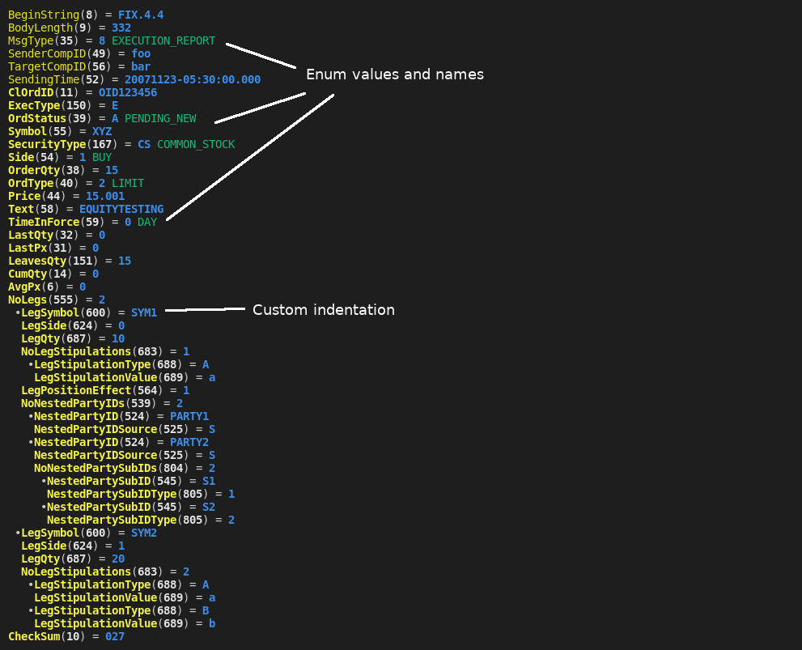
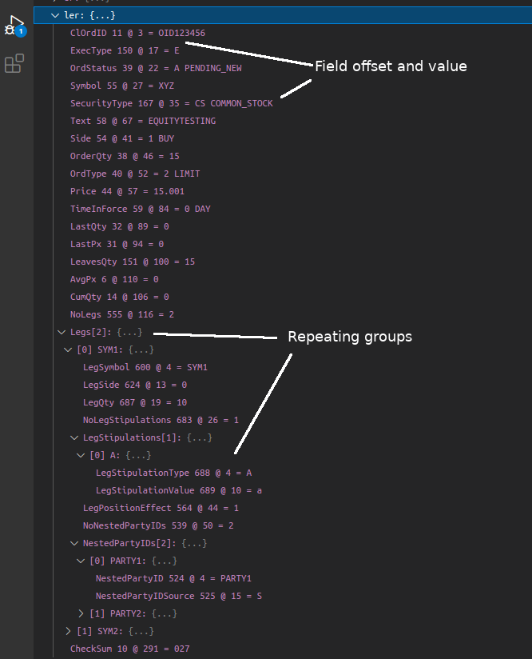

# fixpp stands for FIX by C++ PreProcessor

* [Motivation](#motivation)
* [Performance](#performance)
* [Screenshots](#screenshots)
  - [TTY output](#tty-output)
  - [Debugger view in vscode](#debugger-view-in-vscode)
* [Input](#input)
* [Output](#output)
* [Decode messages](#decode-messages)
  - [Use ParserDispatcher](#use-parserdispatcher)
  - [How to read from socket or file](#how-to-read-from-socket-or-file)
  - [DIY](#diy)
* [Sending API](#sending-api)
  - [FixBufferStream](#)
  - [ReusableMessageBuilder](#)
* [Examples](#examples)
* [Custom HTML output](#custom-html-output)

## Motivation
The idea is to use CPP preprocessing instructions along with standard Linux CLI tools(bash,sed,grep) to generate a FIX API for a given venue.

Mindset:

* No third party dependencies. All the generated code is yours and can go straight into your lib or app.
* Repeating groups are supported.
* You can strip off all useless standard FIX tags to fit your venue specs.

Receiving ([read more](#input)):

* Lightweight and low latency FIX parsing with reusable memory and objects.
* Flexible formatting with available predefined TTY color styles.
* Pretty printing with GDB and VSCode.

Sending ([read more](#sending-api)):

* Low latency FIX message building with reusable memory and objects.
* For a given message type, only fields changing between two sends are to be updated. 

You have to know:

* fixpp is not a FIX engine (yet)
* it runs in an optimistic mode and relies on the venue FIX conformance (this saves quite a few CPU cycles...)

## Performance

> Results obtained in a tight loop on i9-9900K @ 5GHz

| action | message type | length | time, ns | CPU cycles | HW instructions |
|--------|--------------|--------|----------|------------|-----------------|
| decode | ExecReport   |    170 |       75 |        375 |             911 |
| decode | MarketDataSnapshotFullRefresh*  |    330 |       122 |        608 |             1647 |
| encode | NewOrderSingle |    170 |       68 |        338 |             909 |
| update | NewOrderSingle |    170 |       61 |        303 |             821 |

\* 6 repeating groups


## Screenshots

### TTY output


### Debugger view in vscode


## Input

Based on your venue FIX API prepare files `Fields.def`, `Groups.def` and `Messages.def`. One can pick up ready to use files from examples/spec and adjust `Groups.def` and `Messages.def`. `Fields.def` will be cleaned automatically during generation.

**src/spec/Fields.def**
```
FIX_FIELD_BEGIN_STRING( FIX.4.4 )

FIX_FIELD_DECL( Account                       ,      1, STRING         )
FIX_FIELD_DECL( AvgPx                         ,      6, PRICE          )
FIX_FIELD_DECL( BeginSeqNo                    ,      7, SEQNUM         )
FIX_FIELD_DECL( BeginString                   ,      8, STRING         )
FIX_FIELD_DECL( BodyLength                    ,      9, LENGTH         )
FIX_FIELD_DECL( CheckSum                      ,     10, STRING         )
FIX_FIELD_DECL( ClOrdID                       ,     11, STRING         )
...
FIX_ENUM_BEGIN( MsgType )
FIX_ENUM_DECL( MsgType, HEARTBEAT                        , SOHSTR(0) )
FIX_ENUM_DECL( MsgType, TEST_REQUEST                     , SOHSTR(1) )
FIX_ENUM_DECL( MsgType, RESEND_REQUEST                   , SOHSTR(2) )
FIX_ENUM_DECL( MsgType, REJECT                           , SOHSTR(3) )
FIX_ENUM_DECL( MsgType, SEQUENCE_RESET                   , SOHSTR(4) )
FIX_ENUM_DECL( MsgType, LOGOUT                           , SOHSTR(5) )
FIX_ENUM_DECL( MsgType, EXECUTION_REPORT                 , SOHSTR(8) )
FIX_ENUM_DECL( MsgType, LOGON                            , SOHSTR(A) )
FIX_ENUM_DECL( MsgType, ORDER_SINGLE                     , SOHSTR(D) )
FIX_ENUM_DECL( MsgType, MARKET_DATA_REQUEST              , SOHSTR(V) )
FIX_ENUM_DECL( MsgType, MARKET_DATA_SNAPSHOT_FULL_REFRESH, SOHSTR(W) )
FIX_ENUM_DECL( MsgType, MARKET_DATA_INCREMENTAL_REFRESH  , SOHSTR(X) )
FIX_ENUM_DECL( MsgType, MARKET_DATA_REQUEST_REJECT       , SOHSTR(Y) )
FIX_ENUM_END
...
```

**src/spec/Groups.def**
```
FIX_MSG_GROUP_BEGIN( MDEntries, MDEntryType )
FIX_MSG_FIELD( MDEntryPx )
FIX_MSG_FIELD( Currency )
FIX_MSG_FIELD( MDEntryPositionNo )
FIX_MSG_FIELD( MDEntrySize )
FIX_MSG_FIELD( MDEntryDate )
FIX_MSG_FIELD( MDEntryTime )
FIX_MSG_GROUP_END
...
```

**src/spec/Messages.def**
```

FIX_MSG_BEGIN( Header )
FIX_MSG_FIELD( BeginString )
FIX_MSG_FIELD( BodyLength )
FIX_MSG_FIELD( MsgType )
FIX_MSG_FIELD( SenderCompID )
FIX_MSG_FIELD( TargetCompID )
FIX_MSG_FIELD( MsgSeqNum )
FIX_MSG_FIELD( SendingTime )
FIX_MSG_END

FIX_MSG_BEGIN( Heartbeat )
FIX_MSG_FIELD( TestReqID )
FIX_MSG_END

FIX_MSG_BEGIN( Logon )
FIX_MSG_FIELD( EncryptMethod )
FIX_MSG_FIELD( HeartBtInt )
FIX_MSG_FIELD( ResetSeqNumFlag )
FIX_MSG_FIELD( Username )
FIX_MSG_FIELD( Password )
FIX_MSG_END

FIX_MSG_BEGIN( Logout )
FIX_MSG_FIELD( Text )
FIX_MSG_END
...
```

See more in `examples`.

## Output

`/path/to/fixpp/generate.sh -d MYPRJ/src/myprj/fix -s MYPRJ/src/spec -i myprj/fix -n venue::fix  -p MYPRJ/src/gdb`

Where the options are:

* `-d` destination directory
* `-s` specification directory with .def files
* `-i` prefix to use in include statements (ex: `#include <prefix/Field.h>`)
* `-n` namespace to use
* `-p` pretty printers destination dir

It will create the following tree:
```
MYPRJ
├── Makefile
|
└── src
    |
    ├── spec // your input
    |   ├── Fields.def
    |   ├── Groups.def
    |   └── Messages.def
    │
    ├── gdb // generated files
    │   └── printers.py
    |
    └── myprj
        │
        └── fix // generated files
            ├── Debug.h
            ├── Fields.cpp
            ├── Fields.cxx
            ├── Fields.h
            ├── Fields.hxx
            ├── FixApi.h
            ├── Groups.cpp
            ├── Groups.cxx
            ├── Groups.h
            ├── Groups.hxx
            ├── Header.cxx
            ├── Messages.cpp
            ├── Messages.cxx
            ├── Messages.h
            └── Messages.hxx
```

A fully generated and committed primitive project is available in examples/order.

## Decode messages

### Use ParserDispatcher

```cpp
#include <tiny/Messages.h>
#include <cstring>
#include <sstream>

#define I "\001"

const char * buffer = 
// exec report
"8=FIX.4.4" I "9=156" I "35=8" I "49=foo" I "56=bar" I "52=20071123-05:30:00.000" I "11=OID123456" I "150=E" I "39=A" I "55=XYZ" I "167=CS" I "54=1" I "38=15" I "40=2" I "44=15.001" I "58=EQUITYTESTING" I "59=0" I "32=0" I "31=0" I "151=15" I "14=0" I "6=0" I "10=118" I

// large exec report
"8=FIX.4.4" I "9=332" I "35=8" I "49=foo" I "56=bar" I "52=20071123-05:30:00.000" I "11=OID123456" I "150=E" I "39=A" I "55=XYZ" I "167=CS" I "54=1" I "38=15" I "40=2" I "44=15.001" I "58=EQUITYTESTING" I "59=0" I "32=0" I "31=0" I "151=15" I "14=0" I "6=0" I 
"555=2" I "600=SYM1" I "624=0" I "687=10" I "683=1" I
                             "688=A" I "689=a" I
                             "564=1" I
                             "539=2" I "524=PARTY1" I "525=S" I
                                   "524=PARTY2" I "525=S" I
                                   "804=2" I "545=S1" I "805=1" I "545=S2" I "805=2" I
      "600=SYM2" I "624=1" I "687=20" I "683=2" I
                             "688=A" I "689=a" I
                             "688=B" I "689=b" I
"10=027" I

// md full refresh
"8=FIX.4.4" I "9=315" I "35=W" I "49=foo" I "56=bar" I "34=1234" I "52=20190101-01:01:01.000" I "55=EUR/USD" I "268=6" I "269=1" I "290=1" I "270=1.21" I "15=USD" I "271=1000000" I "269=1" I "290=2" I "270=1.211" I "15=USD" I "271=2000000" I "269=1" I "290=3" I "270=1.221" I "15=USD" I "271=3000000" I "269=1" I "290=4" I "270=1.2315" I "15=USD" I "271=4000000" I "269=0" I "290=5" I "270=1.201" I "15=USD" I "271=1000000" I "269=0" I "290=6" I "270=1.205" I "15=USD" I "271=2000000" I "10=075" I;

using namespace venue::fix;

class MyProcessor: public ParserDispatcher
{
    protected:

        virtual void unprocessedMessage( raw_enum_t msgType, MessageBase & msg ) override
        {
            auto it = MsgTypeEnums::itemByRaw.find( msgType );
            const char * typeName = it != MsgTypeEnums::itemByRaw.end() ? it->second->name : "unknown";
            std::cout << "unprocessed " << typeName << std::endl;
        }

        virtual void onMessage( MessageMarketDataSnapshotFullRefresh & msg ) override
        {
            std::cout << "processed " << getCurrentHeader().getMsgType() << " " << msg.getMessageName() << std::endl;
        }

};

int main( int args, const char ** argv )
{
    size_t len = strlen( buffer );
    const char * cursor = buffer;

    MyProcessor mp;
    while( cursor = mp.parseAndDipatch( cursor, len - ( cursor - buffer ) ) )
    {
    }

    return 0;
}
```

### How to read from socket or file

```cpp
    constexpr unsigned begStrAndBodyLenBytes = 20; // reasonably large initial number of bytes to read
    std::vector<char> recvbuffer( 4096 );
    while( source.read( &recvbuffer[0], begStrAndBodyLenBytes ) )
    {
        unsigned msgTypeOffset;
        len = parseMessageLength( &recvbuffer[0], msgTypeOffset ) + 7; // 7 = chsum length
        if( recvbuffer.size() < len + msgTypeOffset )
        {
            recvbuffer.insert( recvbuffer.end(), len + msgTypeOffset - recvbuffer.size() + 100 , 0 );
        }
        // read the remaining bytes
        if( source.read( & recvbuffer[begStrAndBodyLenBytes], len - begStrAndBodyLenBytes + msgTypeOffset ) )
        {
            mp.parseAndDipatch( &recvbuffer[0], len + msgTypeOffset );
        }
        else
        {
            break;
        }
        
    }
```
### DIY

```cpp
#include <myprj/fix/Messages.h>

const char * execReport = "8=FIX.4.4" I "9=332" I "35=8" I "49=foo" I "56=bar" I "52=20071123-05:30:00.000" I
"11=OID123456" I "150=E" I "39=A" I "55=XYZ" I "167=CS" I "54=1" I "38=15" I "40=2" I "44=15.001" I "58=EQUITYTESTING" I "59=0" I "32=0" I "31=0" I "151=15" I "14=0" I "6=0" I 
"555=2" I "600=SYM1" I "624=0" I "687=10" I "683=1" I
                             "688=A" I "689=a" I
                             "564=1" I
                             "539=2" I "524=PARTY1" I "525=S" I
                                   "524=PARTY2" I "525=S" I
                                   "804=2" I "545=S1" I "805=1" I "545=S2" I "805=2" I
      "600=SYM2" I "624=1" I "687=20" I "683=2" I
                             "688=A" I "689=a" I
                             "688=B" I "689=b" I
"10=027" I;

    

    using namespace venue::fix;
    ...

    MessageHeader header;
    // pos = offset from message start
    offset_t pos = header.scan( execReport, strlen( execReport ) );

    MessageExecutionReport er;
    pos = er.scan( execReport + pos, strlen( execReport ) - pos );
    
    // print single field value
    std::cout << ' ' << FixOrdStatus << " = " << er.getOrdStatus() << std::endl;

    // print entire message
    std::cout << "\n\n -- Pretty Printing --" << std::endl;
    
    // use operator <<
    std::cout << fixstr( execReport, ttyRgbStyle ) << std::endl;

    // print flat and advance pos
    pos = 0;
    fixToHuman( execReport, pos, std::cout, ttyRgbStyle ) << std::endl;
    
    // indent groups
    pos = 0;
    fixToHuman( execReport, pos, std::cout, ttyRgbStyle, MessageExecutionReport::getFieldDepth ) << std::endl;    

    // iterate over groups
    if( er.isSetNoLegs() )
    {
        unsigned noLegs = er.getNoLegs();
        for( unsigned legIdx = 0 ; legIdx < noLegs; ++legIdx )
        {
            const GroupLegs & leg = er.getGroupLegs( legIdx );
            std::cout << legIdx << ": side:" << leg.getLegSide() << " qty: " << leg.getLegQty() << std::endl;
        }
    }

```


## Sending API

You will have to include SenderApi.h to build FIX messages with fixpp. It offers both 
- low level buffer construction with FixBufferStream
- and reusable memory approach with ReusableMessageBuilder

### FixBufferStream

This structure has two attributes: `begin` and `end`. Respectively pointing to the message's first and past last byte.
Each time a new field is inserted `end` will shift forward accordingly. In most cases the fields will be appended as tag-value pairs:
```cpp
execReport.append<ClOrdID>("OID4567");
execReport.append<QtyType>( QtyTypeEnums::UNITS.value );
execReport.append<Price>( 21123.04567, 2 );
```

It is also possible to push tags and values separately:
```cpp
execReport.pushTag<ClOrdID>().pushValue("OID4567");
```

### ReusableMessageBuilder
The idea behind is for a given FIX session:
- to reuse the header since most of it's fields will not change,
- to pre-compute the checksum for non-changing header's fields,
- to update only changing time within timestamps since the date does not change intra day.

This structure inherits the `begin` and `end` pointers from FixBufferStream. But `begin` refers to the first changing field like SendingTime for instance. The very first byte of the sending buffer will be pointed to by `start`. The latter will move each time the header's width changes. For example when the sequence number or body length change their widths.
```
buffer   start                msgType                                    sendingTime                  body
|        |                    |                                          |                            |
"..."   "8=FIX.4.4" I "9=315" I "35=W" I "49=foo" I "56=bar" I "34=1234" I "52=20190101-01:01:01.000" I "..."
                                                                         |                            | 
                                                                         begin                        end
```

A typical scenario will be

```cpp
    using namespace fix;
    using namespace fix::field;
    using namespace fix::message;
    ...

    /// before we send it

    // prepare
    ReusableMessageBuilder order( NewOrderSingle::getMessageType(), 512, 128 );
    order.header.append<SenderCompID>("ASENDER");
    order.header.append<TargetCompID>("ATARGET");
    order.header.pushTag<FieldMsgSeqNum>();
    order.header.finalize();

    // append SendingTime to the header
    auto constexpr tsLen  = TimestampKeeper::DATE_TIME_MILLIS_LENGTH;
    auto constexpr tsFrac = TimestampKeeper::Precision::MILLISECONDS;
    order.append<SendingTime>( TimestampKeeper::PLACE_HOLDER, tsLen );
    // initialize the timestamp keeper
    order.sendingTime.setup( order.end - tsLen, tsFrac );
    order.sendingTime.update();
    const unsigned sendingTimeLength = order.end - order.begin;
    ...
    /// sending it
    void sendOrder( const OrderFields & of )
    {
        // move end past SendingTime
        order.rewind( sendingTimeLength );
        // update changing fields in SendingTime
        order.sendingTime.update();
        // append order specific fields
        order.append<Account>( of.account, of.accountLen );
        order.append<ClOrdID>( of.orderId, of.orderIdLen );
        order.append<Symbol>( of.symbol, of.symbolLen );
        order.append<Side>( of.side );
        order.append<Price>( of.price, 6 );
        order.append<OrderQty>( of.qty );
        // copy SendingTime into TransactTime
        order.append<TransactTime>( order.sendingTime.begin, tsLen );
        order.append<OrdType>( of.type );
        // finalize
        order.setSeqnumAndUpdateHeaderAndChecksum(++seqnum);
        // send it
        socket.send( order.start, order.end - order.start );
    }

```

## Examples

To compile the examples you wil have to clone the makefile project next to fixpp:
```
$> git clone https://github.com/sashamakarenko/makefile.git makefile
$> git clone https://github.com/sashamakarenko/fixpp.git fixpp
$> cd fixpp/examples/tiny
$> make
$> make check
```

- `fix44` all committed complete lib with all FIX4.4 messages
- `fixdump` tool to decode FIX messages
- `odd` lib with unit tests with irregular messages
- `tiny` venue specific example with unit tests
- `order` all committed primitive project only with NewOrderSingle and ExecutionReport
- `spec` input files for different FIX standards

## Custom HTML output
```cpp
const FixFormatStyle htmlRgbStyle =
{
    "<pre>",  //  messageBegin 
    "</pre>",  //  messageEnd
    "  ",//  indent
    "  ",//  groupFirstField;
    " ", //  fieldBegin   
    "\n",//  fieldEnd     
    "<font color=\"#444444\">",  //  headerTagNameStart 
    "</font>",  //  headerTagNameStop  
    "<font color=\"black\"><b>",  //  tagNameStart 
    "</b></font>",  //  tagNameStop  
    "<font color=\"grey\">(", //  tagValueStart
    ")</font>", //  tagValueStop 
    " = ", //  equal        
    "<font color=\"darkblue\">",  //  valueStart   
    "</font>",  //  valueStop    
    " <font color=\"darkgreen\">", //  enumStart    
    "</font>",  //  enumStop     
    "<font color=\"red\">",  //  unknownStart
    "</font>"      //  unknownStop
};

...

    std::ofstream html;
    html.open( "mdfr.html" );
    pos = 0;
    fixToHuman( mdFullRefresh, pos, html, htmlRgbStyle, autoIndentFields );        
    html.close();

```

<pre> <font color="#444444">BeginString</font><font color="grey">(8)</font> = <font color="darkblue">FIX.4.4</font>
 <font color="#444444">BodyLength</font><font color="grey">(9)</font> = <font color="darkblue">315</font>
 <font color="#444444">MsgType</font><font color="grey">(35)</font> = <font color="darkblue">W</font> <font color="darkgreen">MARKET_DATA_SNAPSHOT_FULL_REFRESH</font>
 <font color="#444444">SenderCompID</font><font color="grey">(49)</font> = <font color="darkblue">foo</font>
 <font color="#444444">TargetCompID</font><font color="grey">(56)</font> = <font color="darkblue">bar</font>
 <font color="#444444">MsgSeqNum</font><font color="grey">(34)</font> = <font color="darkblue">1234</font>
 <font color="#444444">SendingTime</font><font color="grey">(52)</font> = <font color="darkblue">20190101-01:01:01.000</font>
 <font color="black"><b>Symbol</b></font><font color="grey">(55)</font> = <font color="darkblue">EUR/USD</font>
 <font color="black"><b>NoMDEntries</b></font><font color="grey">(268)</font> = <font color="darkblue">6</font>
   <font color="black"><b>MDEntryType</b></font><font color="grey">(269)</font> = <font color="darkblue">1</font> <font color="darkgreen">OFFER</font>
   <font color="black"><b>MDEntryPositionNo</b></font><font color="grey">(290)</font> = <font color="darkblue">1</font>
   <font color="black"><b>MDEntryPx</b></font><font color="grey">(270)</font> = <font color="darkblue">1.21</font>
   <font color="black"><b>Currency</b></font><font color="grey">(15)</font> = <font color="darkblue">USD</font>
   <font color="black"><b>MDEntrySize</b></font><font color="grey">(271)</font> = <font color="darkblue">1000000</font>
   <font color="black"><b>MDEntryType</b></font><font color="grey">(269)</font> = <font color="darkblue">1</font> <font color="darkgreen">OFFER</font>
   <font color="black"><b>MDEntryPositionNo</b></font><font color="grey">(290)</font> = <font color="darkblue">2</font>
   <font color="black"><b>MDEntryPx</b></font><font color="grey">(270)</font> = <font color="darkblue">1.211</font>
   <font color="black"><b>Currency</b></font><font color="grey">(15)</font> = <font color="darkblue">USD</font>
   <font color="black"><b>MDEntrySize</b></font><font color="grey">(271)</font> = <font color="darkblue">2000000</font>
   <font color="black"><b>MDEntryType</b></font><font color="grey">(269)</font> = <font color="darkblue">1</font> <font color="darkgreen">OFFER</font>
   <font color="black"><b>MDEntryPositionNo</b></font><font color="grey">(290)</font> = <font color="darkblue">3</font>
   <font color="black"><b>MDEntryPx</b></font><font color="grey">(270)</font> = <font color="darkblue">1.221</font>
   <font color="black"><b>Currency</b></font><font color="grey">(15)</font> = <font color="darkblue">USD</font>
   <font color="black"><b>MDEntrySize</b></font><font color="grey">(271)</font> = <font color="darkblue">3000000</font>
   <font color="black"><b>MDEntryType</b></font><font color="grey">(269)</font> = <font color="darkblue">1</font> <font color="darkgreen">OFFER</font>
   <font color="black"><b>MDEntryPositionNo</b></font><font color="grey">(290)</font> = <font color="darkblue">4</font>
   <font color="black"><b>MDEntryPx</b></font><font color="grey">(270)</font> = <font color="darkblue">1.2315</font>
   <font color="black"><b>Currency</b></font><font color="grey">(15)</font> = <font color="darkblue">USD</font>
   <font color="black"><b>MDEntrySize</b></font><font color="grey">(271)</font> = <font color="darkblue">4000000</font>
   <font color="black"><b>MDEntryType</b></font><font color="grey">(269)</font> = <font color="darkblue">0</font> <font color="darkgreen">BID</font>
   <font color="black"><b>MDEntryPositionNo</b></font><font color="grey">(290)</font> = <font color="darkblue">5</font>
   <font color="black"><b>MDEntryPx</b></font><font color="grey">(270)</font> = <font color="darkblue">1.201</font>
   <font color="black"><b>Currency</b></font><font color="grey">(15)</font> = <font color="darkblue">USD</font>
   <font color="black"><b>MDEntrySize</b></font><font color="grey">(271)</font> = <font color="darkblue">1000000</font>
   <font color="black"><b>MDEntryType</b></font><font color="grey">(269)</font> = <font color="darkblue">0</font> <font color="darkgreen">BID</font>
   <font color="black"><b>MDEntryPositionNo</b></font><font color="grey">(290)</font> = <font color="darkblue">6</font>
   <font color="black"><b>MDEntryPx</b></font><font color="grey">(270)</font> = <font color="darkblue">1.205</font>
   <font color="black"><b>Currency</b></font><font color="grey">(15)</font> = <font color="darkblue">USD</font>
   <font color="black"><b>MDEntrySize</b></font><font color="grey">(271)</font> = <font color="darkblue">2000000</font>
 <font color="black"><b>CheckSum</b></font><font color="grey">(10)</font> = <font color="darkblue">075</font>
</pre>

Show message as HTML table:

```cpp
const FixFormatStyle htmlTableRgbStyle =
{
    "<pre><table>",  //  messageBegin 
    "</table></pre>",  //  messageEnd
    "&nbsp;&nbsp;",//  indent
    "&nbsp;&#x2022;",//  groupFirstField;
    "<tr><td>", //  fieldBegin   
    "</td></tr>\n",//  fieldEnd     
    "<font color=\"#444444\">",  //  headerTagNameStart 
    "</font>",  //  headerTagNameStop  
    "<font color=\"black\"><b>",  //  tagNameStart 
    "</b></font>",  //  tagNameStop  
    "<font color=\"grey\">(", //  tagValueStart
    ")</font>", //  tagValueStop 
    " </td><td> ", //  equal        
    "<font color=\"darkblue\">",  //  valueStart   
    "</font>",  //  valueStop    
    " <font color=\"darkgreen\">", //  enumStart    
    "</font>",  //  enumStop     
    "<font color=\"red\">",  //  unknownStart
    "</font>"      //  unknownStop
};
```

<pre><table><tr><td><font color="#444444">BeginString</font><font color="grey">(8)</font> </td><td> <font color="darkblue">FIX.4.4</font></td></tr>
<tr><td><font color="#444444">BodyLength</font><font color="grey">(9)</font> </td><td> <font color="darkblue">332</font></td></tr>
<tr><td><font color="#444444">MsgType</font><font color="grey">(35)</font> </td><td> <font color="darkblue">8</font> <font color="darkgreen">EXECUTION_REPORT</font></td></tr>
<tr><td><font color="#444444">SenderCompID</font><font color="grey">(49)</font> </td><td> <font color="darkblue">foo</font></td></tr>
<tr><td><font color="#444444">TargetCompID</font><font color="grey">(56)</font> </td><td> <font color="darkblue">bar</font></td></tr>
<tr><td><font color="#444444">SendingTime</font><font color="grey">(52)</font> </td><td> <font color="darkblue">20071123-05:30:00.000</font></td></tr>
<tr><td><font color="black"><b>ClOrdID</b></font><font color="grey">(11)</font> </td><td> <font color="darkblue">OID123456</font></td></tr>
<tr><td><font color="black"><b>ExecType</b></font><font color="grey">(150)</font> </td><td> <font color="darkblue">E</font></td></tr>
<tr><td><font color="black"><b>OrdStatus</b></font><font color="grey">(39)</font> </td><td> <font color="darkblue">A</font> <font color="darkgreen">PENDING_NEW</font></td></tr>
<tr><td><font color="black"><b>Symbol</b></font><font color="grey">(55)</font> </td><td> <font color="darkblue">XYZ</font></td></tr>
<tr><td><font color="black"><b>SecurityType</b></font><font color="grey">(167)</font> </td><td> <font color="darkblue">CS</font> <font color="darkgreen">COMMON_STOCK</font></td></tr>
<tr><td><font color="black"><b>Side</b></font><font color="grey">(54)</font> </td><td> <font color="darkblue">1</font> <font color="darkgreen">BUY</font></td></tr>
<tr><td><font color="black"><b>OrderQty</b></font><font color="grey">(38)</font> </td><td> <font color="darkblue">15</font></td></tr>
<tr><td><font color="black"><b>OrdType</b></font><font color="grey">(40)</font> </td><td> <font color="darkblue">2</font> <font color="darkgreen">LIMIT</font></td></tr>
<tr><td><font color="black"><b>Price</b></font><font color="grey">(44)</font> </td><td> <font color="darkblue">15.001</font></td></tr>
<tr><td><font color="black"><b>Text</b></font><font color="grey">(58)</font> </td><td> <font color="darkblue">EQUITYTESTING</font></td></tr>
<tr><td><font color="black"><b>TimeInForce</b></font><font color="grey">(59)</font> </td><td> <font color="darkblue">0</font> <font color="darkgreen">DAY</font></td></tr>
<tr><td><font color="black"><b>LastQty</b></font><font color="grey">(32)</font> </td><td> <font color="darkblue">0</font></td></tr>
<tr><td><font color="black"><b>LastPx</b></font><font color="grey">(31)</font> </td><td> <font color="darkblue">0</font></td></tr>
<tr><td><font color="black"><b>LeavesQty</b></font><font color="grey">(151)</font> </td><td> <font color="darkblue">15</font></td></tr>
<tr><td><font color="black"><b>CumQty</b></font><font color="grey">(14)</font> </td><td> <font color="darkblue">0</font></td></tr>
<tr><td><font color="black"><b>AvgPx</b></font><font color="grey">(6)</font> </td><td> <font color="darkblue">0</font></td></tr>
<tr><td><font color="black"><b>NoLegs</b></font><font color="grey">(555)</font> </td><td> <font color="darkblue">2</font></td></tr>
<tr><td>&nbsp;&#x2022;<font color="black"><b>LegSymbol</b></font><font color="grey">(600)</font> </td><td> <font color="darkblue">SYM1</font></td></tr>
<tr><td>&nbsp;&nbsp;<font color="black"><b>LegSide</b></font><font color="grey">(624)</font> </td><td> <font color="darkblue">0</font></td></tr>
<tr><td>&nbsp;&nbsp;<font color="black"><b>LegQty</b></font><font color="grey">(687)</font> </td><td> <font color="darkblue">10</font></td></tr>
<tr><td>&nbsp;&nbsp;<font color="black"><b>NoLegStipulations</b></font><font color="grey">(683)</font> </td><td> <font color="darkblue">1</font></td></tr>
<tr><td>&nbsp;&nbsp;&nbsp;&#x2022;<font color="black"><b>LegStipulationType</b></font><font color="grey">(688)</font> </td><td> <font color="darkblue">A</font></td></tr>
<tr><td>&nbsp;&nbsp;&nbsp;&nbsp;<font color="black"><b>LegStipulationValue</b></font><font color="grey">(689)</font> </td><td> <font color="darkblue">a</font></td></tr>
<tr><td>&nbsp;&nbsp;<font color="black"><b>LegPositionEffect</b></font><font color="grey">(564)</font> </td><td> <font color="darkblue">1</font></td></tr>
<tr><td>&nbsp;&nbsp;<font color="black"><b>NoNestedPartyIDs</b></font><font color="grey">(539)</font> </td><td> <font color="darkblue">2</font></td></tr>
<tr><td>&nbsp;&nbsp;&nbsp;&#x2022;<font color="black"><b>NestedPartyID</b></font><font color="grey">(524)</font> </td><td> <font color="darkblue">PARTY1</font></td></tr>
<tr><td>&nbsp;&nbsp;&nbsp;&nbsp;<font color="black"><b>NestedPartyIDSource</b></font><font color="grey">(525)</font> </td><td> <font color="darkblue">S</font></td></tr>
<tr><td>&nbsp;&nbsp;&nbsp;&#x2022;<font color="black"><b>NestedPartyID</b></font><font color="grey">(524)</font> </td><td> <font color="darkblue">PARTY2</font></td></tr>
<tr><td>&nbsp;&nbsp;&nbsp;&nbsp;<font color="black"><b>NestedPartyIDSource</b></font><font color="grey">(525)</font> </td><td> <font color="darkblue">S</font></td></tr>
<tr><td>&nbsp;&nbsp;&nbsp;&nbsp;<font color="black"><b>NoNestedPartySubIDs</b></font><font color="grey">(804)</font> </td><td> <font color="darkblue">2</font></td></tr>
<tr><td>&nbsp;&nbsp;&nbsp;&nbsp;&nbsp;&#x2022;<font color="black"><b>NestedPartySubID</b></font><font color="grey">(545)</font> </td><td> <font color="darkblue">S1</font></td></tr>
<tr><td>&nbsp;&nbsp;&nbsp;&nbsp;&nbsp;&nbsp;<font color="black"><b>NestedPartySubIDType</b></font><font color="grey">(805)</font> </td><td> <font color="darkblue">1</font></td></tr>
<tr><td>&nbsp;&nbsp;&nbsp;&nbsp;&nbsp;&#x2022;<font color="black"><b>NestedPartySubID</b></font><font color="grey">(545)</font> </td><td> <font color="darkblue">S2</font></td></tr>
<tr><td>&nbsp;&nbsp;&nbsp;&nbsp;&nbsp;&nbsp;<font color="black"><b>NestedPartySubIDType</b></font><font color="grey">(805)</font> </td><td> <font color="darkblue">2</font></td></tr>
<tr><td>&nbsp;&#x2022;<font color="black"><b>LegSymbol</b></font><font color="grey">(600)</font> </td><td> <font color="darkblue">SYM2</font></td></tr>
<tr><td>&nbsp;&nbsp;<font color="black"><b>LegSide</b></font><font color="grey">(624)</font> </td><td> <font color="darkblue">1</font></td></tr>
<tr><td>&nbsp;&nbsp;<font color="black"><b>LegQty</b></font><font color="grey">(687)</font> </td><td> <font color="darkblue">20</font></td></tr>
<tr><td>&nbsp;&nbsp;<font color="black"><b>NoLegStipulations</b></font><font color="grey">(683)</font> </td><td> <font color="darkblue">2</font></td></tr>
<tr><td>&nbsp;&nbsp;&nbsp;&#x2022;<font color="black"><b>LegStipulationType</b></font><font color="grey">(688)</font> </td><td> <font color="darkblue">A</font></td></tr>
<tr><td>&nbsp;&nbsp;&nbsp;&nbsp;<font color="black"><b>LegStipulationValue</b></font><font color="grey">(689)</font> </td><td> <font color="darkblue">a</font></td></tr>
<tr><td>&nbsp;&nbsp;&nbsp;&#x2022;<font color="black"><b>LegStipulationType</b></font><font color="grey">(688)</font> </td><td> <font color="darkblue">B</font></td></tr>
<tr><td>&nbsp;&nbsp;&nbsp;&nbsp;<font color="black"><b>LegStipulationValue</b></font><font color="grey">(689)</font> </td><td> <font color="darkblue">b</font></td></tr>
<tr><td><font color="black"><b>CheckSum</b></font><font color="grey">(10)</font> </td><td> <font color="darkblue">027</font></td></tr>
</table></pre>
